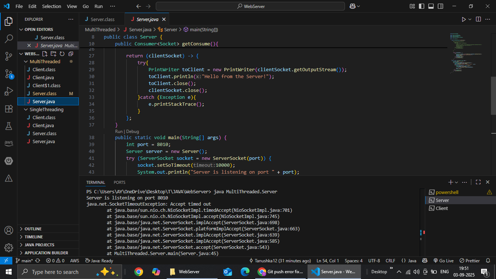
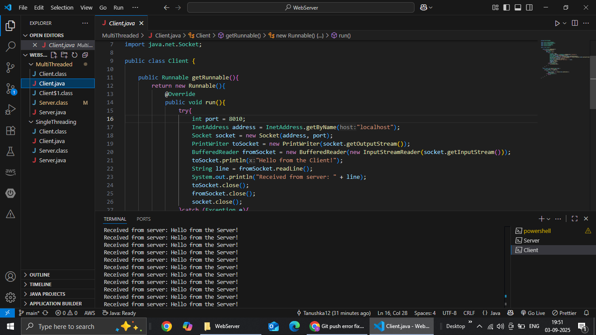

# Single & Multi-Threaded Client-Server in Java

This repository contains implementations of **single-threaded** and **multi-threaded** client-server communication using Java Socket Programming.

## 📌 Overview
- **Single-threaded Server** → Can handle only one client at a time.  
- **Multi-threaded Server** → Can handle multiple clients simultaneously using threads.  

This project demonstrates the difference between synchronous and concurrent server architectures.

## 🛠 Tech Stack
- Java (JDK 8+)  
- Socket Programming (TCP/IP)  
- Threading & Concurrency  

## 🚀 How to Run
1. Clone the repository:
   ```bash
   git clone https://github.com/Tanukash12/Single-Multi-Threaded.git
2. Navigate to either the SingleThreaded or MultiThreaded folder.
3. Compile the code:
   ### javac Server.java Client.java
4. Run the server: java Server
5. Run one or more clients(MultiThreaded): java Client

## 📸 Screenshots

### MUlti-threaded Server


### Multi-threaded Client



## 📂 Project Structure
- `MultiThreaded/` → Contains Server & Client (multi-threaded)
- `SingleThreaded/` → Contains Server & Client (single-threaded)
- `README.md` → Documentation

## Key TakeAways
- Hands-on experience with Java Networking (Socket, ServerSocket).
- Built and compared single-threaded vs. multi-threaded server models.
- Practical understanding of thread management and concurrency in real-time communication.
